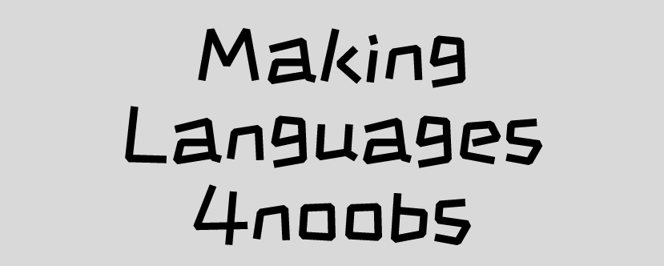

  

  <h2 align="center">MakingLanguages4noobs</h2>

  <h1 align="center"></h1>
  
  

     
    <a href="#ROADMAP"><strong>Explore a documentação »</strong></a>
     
     
    <a href="[link-para-abrir-issue](https://github.com/andreluispy/makinglanguages4noobs/issues)">Report Bug</a>
    ·
    <a href="[link-para-abrir-issue](https://github.com/andreluispy/makinglanguages4noobs/issues)">Request Feature</a>
  

## Sobre o Projeto
 Aprenda como criar linguagens com um manual onde você aprenderá a lógica por trás de compiladores / interpretadores e criará 2 interpretadores e 2 compiladores

## ROADMAP

- [1 - Introdução](conteudos/1-introducao/README.md)

## Como Contribuir

Contribuições fazem com que a comunidade open source seja um lugar incrível para aprender, inspirar e criar. Todas contribuições
são **extremamente apreciadas**

1. Realize um Fork do projeto
2. Crie um branch com a nova feature (`git checkout -b feature/featureBraba`)
3. Realize o Commit (`git commit -m 'Adicionado conteudo brabo'`)
4. Realize o Push no Branch (`git push origin feature/featureBraba`)
5. Abra um Pull Request

## Autores

- **André Luís** - IA, Data Science and Compilers Student - [github](https://github.com/andreluispy)

---

  

